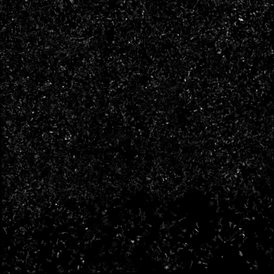
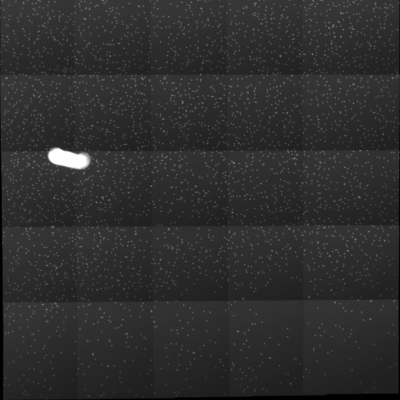

# if-stitch

if-stitch is a Python script for 2D-stitching of images from immunofluorescence microscopy.
Typically, many images are taken from 96- or 384-well microplates. One well can consist of a grid of several fields.
The aim is to stitch the field of particular wells together so that cells in the border area can be mapped completely.
This might be helpful for cell segmentation where truncated cells would be excluded otherwise. Another advantage is that
cellular networks across fields can be detected.
if-stitch works with images that are overlapping, best around 15-30%. The images should be sorted from left to right
and top to bottom.

## How it works

<p align="center">
    
</p>
<em>Pipeline for Panorama Stitching in OpenCV. Mosaic Stitching works similar.</em>
<br/><br/>

**OpenCV** is a library of programming functions for computer vision with a lot of useful implementations for image stitching.

* First, images are **resized** for faster processing.
* **OpenCV's SIFT** has been used to detect **features** and **descriptors** in the images.
* A **FLANN based Matcher** matches similar keypoints.
* A **3x3 Homography Matrix** is calculated from the matched keypoints that can be used to transform the second image so that it overlaps the first one. 
This is done by **warpPerspective**.
* The calculated homography matrices for each field are changed to that they can be applied to the images in original size.
* Images are then warped in every channel based on homography matrices.
* In general the images are first stitched to panoramas of rows. Then the panoramas are stitched together.

## Example

TexasRed Stitched (and Corrected)             |  DAPI Stitched (without Correction)
:-------------------------:|:-------------------------:
  |  

## Usage

The working directory should be `your/path/if-stitch/`. Use in Terminal.
```
python if-stitch.py -i /path/to/input -o /path/to/output -gr 5 5
```

## Arguments

### Required

* `--input`, `-i`: Path to folder with all images of one plate.
* `--output`, `-o`: Path to folder where stitched images should be stored.
* `--grid`, `-gr`: Two integers that define number of rows and columns.

### Optional

* `--string`, `-s`: String by which name of well can be identified from filename. Default is "{r} - {cc}" 
where r is a letter between A and H and cc a digit between 1 and 12.
* `--channels`, `-ch`: A list or tuple of channel names that will be stitched individually. 
Default is ('TexasRed', 'DAPI', 'FITC', 'Cy3', 'Cy5').
* `--mainchannel`, `-m`: Channel with the most features used to find homography. Default is 'TexasRed'.
* `--ratio`, `-r`: Ratio for Lowe's test which is applied to filter matches.
* `--thresh`, `-t`: Reprojection Threshold to find the best matches for the homography matrix.

## Requirements

* OpenCV: `pip install opencv-contrib-python`
* Numpy: `pip install numpy`
* Imutils: `pip install imutils`

## Notes

* Since illumination of images is typically inhomogeneous, **illumination correction** is advisable before stitching.
This will also improve keypoint matching. The stitched DAPI image shows an example without illumination correction.
* Often not all parts of a field are in focus, which may result in two overlapping fields, where the overlapping parts
have different image depths. Thus, keypoints and descriptors can be different even though the region of interest is the same.
**Focus stacking** for example could help out here.

## Troubleshooting
* Depending on the images and features sometimes the result might be worse than expected. If the stitched image looks like
two fields are not matched correctly, try to change ratio or the reprojection Threshhold.

## References

* [Feature Matching with OpenCV](https://docs.opencv.org/master/dc/dc3/tutorial_py_matcher.html)
* [Homography Matrix in OpenCV](https://docs.opencv.org/master/d1/de0/tutorial_py_feature_homography.html)

### Other useful links

* [Good overview on image alignment](https://www.learnopencv.com/image-alignment-feature-based-using-opencv-c-python/)
* [Useful tutorial on perspective warp](https://medium.com/acmvit/how-to-project-an-image-in-perspective-view-of-a-background-image-opencv-python-d101bdf966bc)
* [Tutorial for panorama stitching](https://www.pyimagesearch.com/2016/01/11/opencv-panorama-stitching/)

